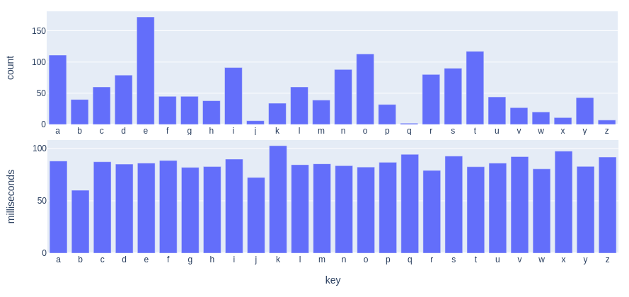
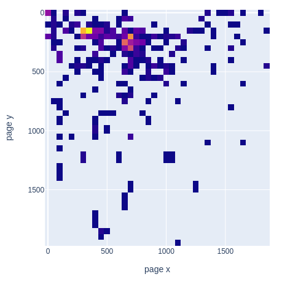
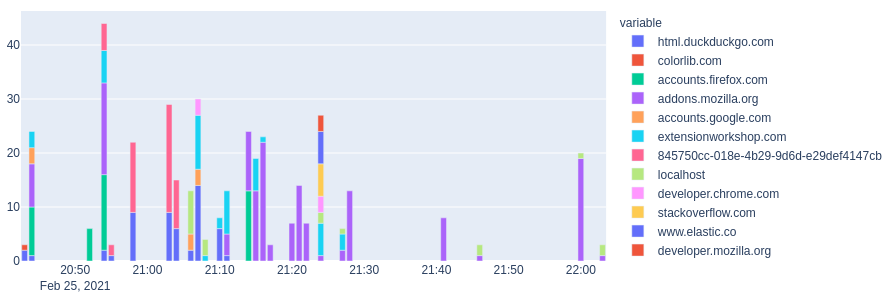

# Überwachung für Alle!

... is a splendid new plugin for browsers that actually lessens your privacy. 
Or in other words, if you do leak data, do it at your own will!

All web requests, tab changes, mouse and keyboard events are collected 
and sent to an [elasticsearch](https://www.elastic.co/guide/index.html) 
server for further statistical inspection.
Or in other words:

If you do watch porn on the internet then stay up to date with 
profiling technology and investigate your own behaviour with even more detailed 
data than the pink amagoo microbook porn industry itself is able to collect.

### Try it then?

Well, this is just an early plugin stage but seems to work good with 
firefox and chromium a.t.m.

#### firefox

In firefox go to `about:debugging`, select *This Firefox* and browse 
for the [manifest.json](manifest.json).

Or permanently install a signed package from the [dist/firefox/](dist/firefox)
folder by clicking the gear icon on the `about:addons` page.

It's submitted for listing on 
[addons.mozilla.org](https://addons.mozilla.org/en-US/firefox/addon/%C3%BCberwachung-f%C3%BCr-alle/)
but got rejected with the elaborate comment *"Spam content"*.

#### chrome/chromium

In chromium open `chrome://extensions/`, enable *Developer mode* and 
click *Load unpacked*. 

### How to?

Once it's loaded, click the  and open 
the configuration. All surveillance features are deactivated by default.

To see the structure of the event objects that are exported open the *Investigate*
page and click on one of the events.

### Important

This is a fun project but it actually can leak confidential 
data so be careful where you export your data to. There is no hidden 
communication to Microsoft or anyone else, unless you specifically say 
so in the configuration.

---

And now, apart from this great plugin here is something personal i share. 
The count and average duration of the alphabetic keys that i pressed while 
writing this readme and the script for these images in a jupyter notebook:

Yes, now that i see it, i like pressing the `k` a bit longer but i didn't 
know about my aversion to `b`...

Here is where i clicked most:

And the number of tab changes when trying to publish this addon:

